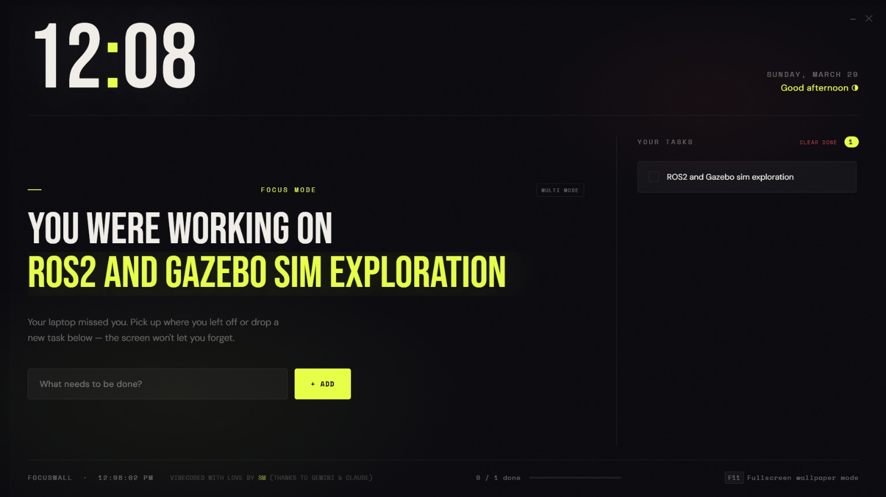

# ⚡ FocusWall

**FocusWall** is a sleek, distraction-free desktop application designed to turn your screen into an immersive, aesthetic productivity dashboard. Say goodbye to scattered sticky notes and cluttered browser tabs—FocusWall takes over your monitor to ensure your absolute top-priority is always directly in front of you.



## ✨ Features
- **Glorious Kiosk Aesthetic:** Launches in full borderless mode to act as an immersive edge-to-edge wallpaper replacement.
- **Auto-Startup Desktop Integration:** Seamlessly boots up natively in the background the moment Windows starts.
- **Single Focus Mode:** Displays your absolute most important task in giant, glowing neon typography so it is impossible to ignore.
- **Multi-Mode:** Smoothly switch into a gorgeous scrollable list of all your queued tasks featuring a dynamic parallax scale-and-fade effect.
- **Frictionless Task Management:** Add, toggle, and strike out tasks instantly without complex menus.
- **Custom Native Controls:** Custom embedded window controls (`—` and `✕`) built specifically for a clean look.
- **Dashboard Utilities:** Integrated dynamic clock, date, persistent auto-greeting, and visual completion progress tracker.

## 🚀 How to Run

1. Download the [FocusWall Desktop Package from Google Drive](https://drive.google.com/file/d/1kS9K0NZHRIfXM94eUnqnQcFQdE4ayGqZ/view?usp=sharing).
2. Extract the **entire folder** to your desktop or program files.
3. Double-click `FocusWall.exe` inside the folder to launch the dashboard.

*(Tip: Press `F11` while inside the app to toggle true fullscreen overlay mode!)*

## 🛠 For Developers

If you'd like to tweak the source code or run the raw Electron app yourself:

```bash
# Clone the repository
git clone https://github.com/Seikh05/focus-wall.git

# Install Electron dependencies
npm install

# Test the app in development mode
npm start
```

---
*🛠️ Forged out of sheer procrastination by [Seikh Mustakim](https://github.com/Seikh05) ☕ (With intense moral support from Gemini ✨ & Claude 🤖)*
